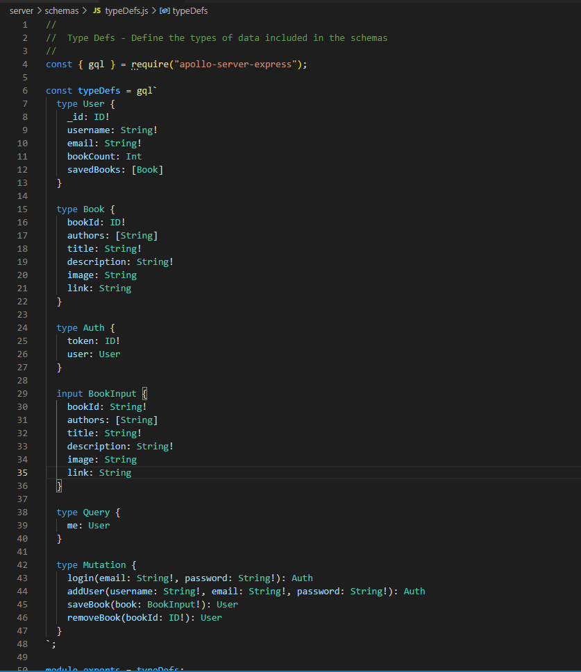
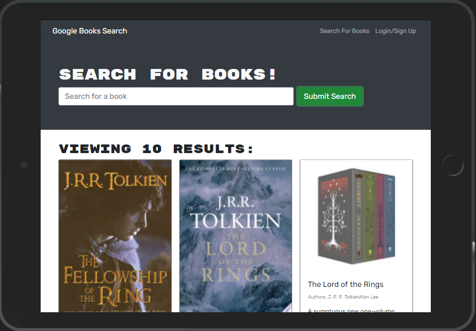
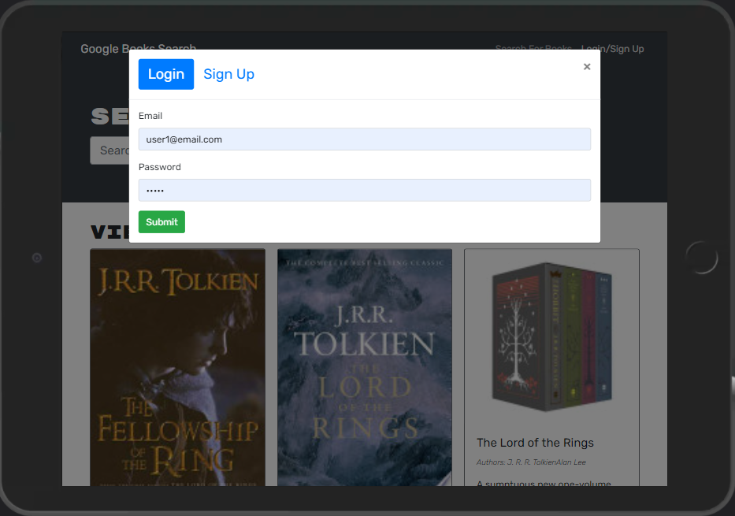
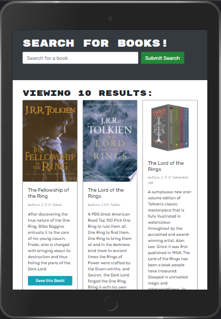

# Unit 21 MERN: Book Search Engine

## Your Task

This is a fully functioning **Google Books API Search Engine** refactored from a **RESTful API** into a **GraphQL API** running on [Apollo Server](https://www.apollographql.com/). It allows users to save book searches to the backend and to localStorage for session handling and performance optimization. The application was built using the **MERN** (_Mongo_, _Express_, _React_, and _Node_) Stack with a **React** front end, **MongoDB** database, and **NodeJS** and **ExpressJS** server and API.

## User Story

```md
AS AN avid reader
I WANT to search for new books to read
SO THAT I can keep a list of books to purchase
```

## Acceptance Criteria

```md
GIVEN a book search engine
WHEN I load the search engine
THEN I am presented with a menu with the options Search for Books and Login/Signup and an input field to search for books and a submit button
WHEN I click on the Search for Books menu option
THEN I am presented with an input field to search for books and a submit button
WHEN I am not logged in and enter a search term in the input field and click the submit button
THEN I am presented with several search results, each featuring a book’s title, author, description, image, and a link to that book on the Google Books site
WHEN I click on the Login/Signup menu option
THEN a modal appears on the screen with a toggle between the option to log in or sign up
WHEN the toggle is set to Signup
THEN I am presented with three inputs for a username, an email address, and a password, and a signup button
WHEN the toggle is set to Login
THEN I am presented with two inputs for an email address and a password and login button
WHEN I enter a valid email address and create a password and click on the signup button
THEN my user account is created and I am logged in to the site
WHEN I enter my account’s email address and password and click on the login button
THEN I the modal closes and I am logged in to the site
WHEN I am logged in to the site
THEN the menu options change to Search for Books, an option to see my saved books, and Logout
WHEN I am logged in and enter a search term in the input field and click the submit button
THEN I am presented with several search results, each featuring a book’s title, author, description, image, and a link to that book on the Google Books site and a button to save a book to my account
WHEN I click on the Save button on a book
THEN that book’s information is saved to my account
WHEN I click on the option to see my saved books
THEN I am presented with all of the books I have saved to my account, each featuring the book’s title, author, description, image, and a link to that book on the Google Books site and a button to remove a book from my account
WHEN I click on the Remove button on a book
THEN that book is deleted from my saved books list
WHEN I click on the Logout button
THEN I am logged out of the site and presented with a menu with the options Search for Books and Login/Signup and an input field to search for books and a submit button
```

## Implementation

- [Features](#features)
- [Installation](#installation)
- [Usage](#usage)
- [License](#license)

## Features

On the technical architecture, the application features the use of **React** to handle a responsive, stateful user interface; **GraphQL** for data query and manipulation through APIs; **Apollo Server**, a GraphQL Server that can use data from disparate sources; **Apollo Client**, a state management library to manage GraphQL operations; **Mongoose** and **MongoDB** to define the logical structure of the database and provide a means to manage the underlying data structures; **HTML**, **Bootstrap**, and **Javascript** to enable the input and client-side validation of the application data; **Express.Js** for route handling and file serving, and **Node.Js** for Javascript running.

The application uses three schemas hosted on the **NoSQL** database (**MongoDb**), which are accessed through **APIs** built on **GraphQL**: _User_, _Book_, and _Auth_ as shown below:



Functionally, the application allows users to perform the following CRUD operations:

- Browse books through a fully functional **React** application
- Save book searches to the database for future reference
- Remove book searches from the database
- Login existing users through a token-based authentication mechanism
- Sign up new users with immediate sign in to the application







## Installation

The application requires [Node.Js](https://nodejs.org/en/) Runtime Library, [Express.js](https://www.npmjs.com/package/express), [Mongoose](https://www.npmjs.com/package/mongoose) libraries, along with a running _local_ instance of [MongoDb](https://www.mongodb.com/), or a _cloud_ instance of **MongoDb** known as [Atlas](https://www.mongodb.com/cloud/atlas), [React](https://www.npmjs.com/package/react), [Apollo Server](https://www.npmjs.com/package/apollo-server), [Apollo Client](https://www.npmjs.com/package/@apollo/client), and [GraphQL](https://www.npmjs.com/package/graphql).

A JSON file containing these dependencies is included with this project. To set up the development environment for the application, simply run the following command:

```bash
npm install
```

Once the required packages are installed, run the following command to start the application:

```bash
npm run develop
```

## Usage

The application has been coded with a _mobile first_ approach in mind. It allows users to perform CRUD operations against a live **MongoDb** database using the following HTTP methods for REST APIs: _GET_ and _POST_. If you want to run the application in your development environment, make sure to follow the [Installation](#installation) instructions above; otherwise, the application has been deployed to [Heroku](https://ku-cbc-googlebooks.herokuapp.com/) through a **CI/CD** pipeline, which also connects to a live **MongoDb Atlas** database.

## License

This project is licensed under The MIT License. Refer to https://opensource.org/licenses/MIT for more information of what you can and cannot do with this project. See contact information below if you have questions, comments, or suggestions for the project.

## Contributing Guidelines

Want to contribute to this project? You may clone or fork the project in GitHub. Note the licesing information referred in this file.

## Contact Information

For questions, comments, or suggestions, please contact me by E-Mail:

japinell@yahoo.com

Check out my other **cool** projects in GitHub - https://github.com/japinell

## License

This application is licensed under the following license:

[](https://opensource.org/licenses/MIT)(https://opensource.org/licenses/MIT)
